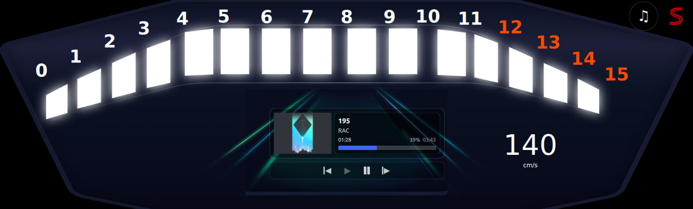

<!-- cluster 부분 -->
# Instrument Cluster

### Contents
- [Cluster GUI](#cluster-gui) 
- [Hardware](#hardware)
- [System architecture](#system-architecture)
- [Build & Run](#build--run--application)
- [Automize system](#Automize-system)
- [About CAN communication](#-can-communication)
- [About Battery](#-battery)

## Cluster GUI(first mode)
<!-- <p align="center"> -->

<!-- </p> -->

## Cluster GUI(second mode)
<!-- <p align="center"> -->

<!-- </p> -->


## Hardware
<!-- <p align="center"> -->

<!-- </p> -->


### Hardware components
- **Raspberry Pi 4B**
- **Arduino uno**
- **Waveshare 7.9inch LCD-DSI**
- **Speed sensor**
- **Can shield & Can hat**
<!-- 구성요소 링크 추가 ? ?? -->


## System architecture


<!-- 멀티프로세싱이랑, 신호가 어떻게 전달되는지 들어가있나? -->

### Software components
 - **Raspberry Pi OS aarch64**
 - **python venv**
 - **python 3.10**
 - **Qt 6.9.1**
 - **Qtquick 6.4.2**
 - **python multiprocessing**


## Build & Run  Application
```bash
# bash

cd SEA-ME-DES/src/Cluster/Cluster

mkdir build

cd build

# you have to check cmake version & cmakelist.txt
cmake ..

make 

# run
./ClusterApp
```

## Automize system 
If you go through this process, instead of running launch.py , the system will start automatically when you boot it.

```bash
# bash 

# edit system service file
sudo nano /etc/systemed/system/piracer.service 

# cooy and paste this file
[Unit]
Description=PiRacer Qt Launcher
After=graphical.target

[Service]
Type=simple
User=pi
Environment=DISPLAY=:0
WorkingDirectory=/home/pi/SEA-ME-DES
ExecStart=/home/pi/SEA-ME-DES/piracer/bin/python /home/pi/SEA-ME-DES/launch.py
Restart=on-failure
RestartSec=5

[Install]
WantedBy=graphical.target

# edit 'pi' to your os user name 
# ctrl + o  and ctrl + x to save and exit 

# reload daemon 
sudo systemctl daemon-reload

# activate service
sudo systemctl enable piracer.service

# for test  and check 
sudo systemctl restart piracer.service
sudo systemctl status piracer.service

# reboot
sudo reboot 
sudo journalctl -b -u piracer.service -f
```


## 🔗 CAN communication
### CAN Communication Test

```bash
# bash

# Upload Arduino Ide
src/Arduino/can_speed.ino

# for can test
cd src/board

python3 can_rpm.py 

or 

candump can0
```


### To automize CAN setting 
If you want to automize CAN setting , follow down.
```bash
# bash

# create new service file
sudo nano /etc/systemd/system/can0.service 
```
```bash
# paste this file 
[Unit]
Description=Setup CAN interface can0
Wants=network.target
After=network.target

[Service]
Type=oneshot
ExecStart=/sbin/ip link set can0 up type can bitrate 500000 restart-ms 100
ExecStop=/sbin/ip link set can0 down
RemainAfterExit=yes

[Install]
WantedBy=multi-user.target
```

```bash
# bash

# save file & activate
sudo systemctl daemon-reload

sudo systemctl enable can0.service

# reboot and check 
sudo reboot

candump can0
```

## 🔋 Battery 
### check the battery voltage
```bash
# bash

sudo apt install i2c-tools

i2cget -y 1 0x41 0x02 w
```


## References
1. The Qt Company (2021). Qt 5.15.0 Reference Documentation. Available at: https://doc.qt.io/archives/qt-5.15/index.html
2. CAN BUS wiki. Available at : https://wiki.seeedstudio.com/CAN-BUS_Shield_V2.0/  
3. Qt Design studio Example. Available at https://doc.qt.io/qtdesignstudio/studioexamples.html
